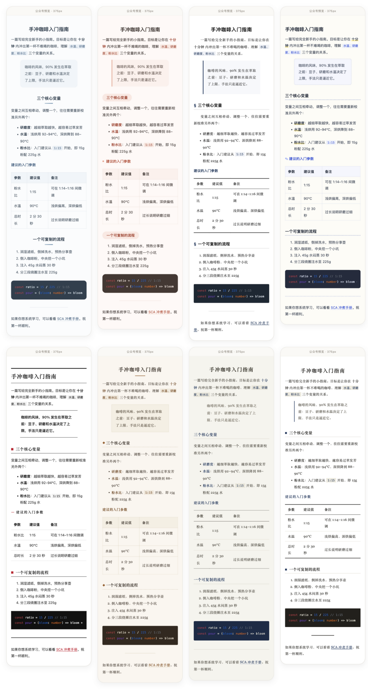

# Markdown Publisher

<p align="center">
  
  
  
</p>

> **在 Obsidian 写好笔记，一键排成公众号文章，直接存进草稿箱。**

Markdown Publisher 把「写」和「发」之间的排版工作全部自动化：套上设计师主题、内联全部样式、压缩并上传图片、转存外链图片、生成封面，最后把成稿送进微信公众号草稿箱。你只需要在手机上确认，然后群发。

<p align="center">
  <a href="https://volcanicll.github.io/obsidian-md-publisher/">🌍 在线体验</a> ·
  <a href="./docs/USAGE.md">📖 完整使用说明</a> ·
  <a href="#-安装">⬇️ 安装</a> ·
  <a href="https://github.com/volcanicll/obsidian-md-publisher/issues">💬 反馈问题</a>
</p>

## English

**Markdown Publisher** is an Obsidian plugin that turns your notes into WeChat Official Account-ready articles and saves them straight to your draft box.

- **Eight designer themes** ("Paper Press" set), plus 14 official highlight.js code themes, custom themes from a vault folder, and a fully custom option
- **Fully inlined CSS**, so pasted or published HTML keeps its styling in the WeChat editor
- **Automatic image handling**: local images are compressed and uploaded to the WeChat CDN, external images are re-hosted, GIF animations are preserved, and SVG/WebP are converted
- **Mermaid diagrams** render to crisp PNG images and upload automatically; **Obsidian Callouts** become styled cards; **note embeds** (`![[note]]`, `![[note#heading]]`) are inlined as quote blocks
- **Pre-publish preview & checks**: a phone-frame mock of the actual WeChat article, link validity checking, heuristic sensitive-word detection, and live field-length counters
- **Bidirectional scroll sync** between the editor and the preview pane
- **Automatic covers**: uses your chosen cover, the article's first image, or a generated title card
- **Fails safely**: if any image fails to upload, publishing is cancelled instead of leaving a broken draft
- **KaTeX math**, GFM tables, task lists, footnotes, and Obsidian `![[image.png]]` embeds

Install it from the Obsidian community plugins browser (search for "Markdown Publisher") or download the latest release. To publish, configure your WeChat Official Account with an AppID/AppSecret pair (requires an IP allowlist) or paste a temporary access token if your IP changes often.

---



## 🎨 八套排版主题，一套设计语言

不做「换汤不换药」的配色套餐，而是四组不同的版式语言，每组两套：

| 家族 | 主题 | 适合 |
|------|------|------|
| 柔和轻氧 | **晨雾 Mist**（默认）· 蜜桃 Peach | 生活、科普、职场、成长 |
| 学院学术 | **学报 Journal** · 笔记 Notes | 长文、深度阅读、学习笔记 |
| 杂志风尚 | **封面 Cover** · 别册 Booklet | 人物、品牌、文化、散文 |
| 素纸墨蓝 | **信笺 Letter** · 拓本 Rubbing | 书信散文、慢读；资料整理、严肃长文 |

所有主题都针对公众号移动端阅读设计：只用内联样式、系统字体栈、无 hover、无外部资源，预览即发布效果。另有 14 款代码高亮主题（GitHub、Monokai、Dracula、Nord 等），写技术文章同样得体。

## 📤 发布链路，交给它

- **直接存入草稿箱**：填好标题、作者、摘要，一键送达草稿箱，手机上预览后群发。
- **发布前预览与校验**：手机框模拟公众号文章页实际效果；支持链接有效性检查、敏感词检测（内置词表 + 自定义词条）、字段长度核查，结果仅提示不拦截。
- **内容格式兼容**：Mermaid 图表自动转 PNG 并上传；Callout 提示框转为公众号卡片样式（支持折叠写法）；`![[笔记名]]` 与 `![[笔记名#标题]]` 嵌入转为引用块。
- **封面自动处理**：自动用正文首图作封面；全文无图时可指定封面图，或按文章标题自动生成标题卡片封面。
- **图片全自动**：本地图片自动压缩上传，外链图片自动转存；GIF 保留动画，WebP / BMP / SVG 自动转 PNG，PNG 转 JPEG 时自动铺白底，不出现黑底。
- **失败即中止**：任一图片上传失败就取消发布并明确提示，绝不产出残留本地路径的裂图草稿。
- **草稿箱管理**：在插件内分页查看、删除草稿箱内容。
- **也可以只复制**：不想配置 API？点「复制」，到公众号后台粘贴，排版原样保留。
- **完整 Markdown 能力**：GFM 表格、任务列表、脚注、删除线，KaTeX 行内与块级公式，代码块高亮，Obsidian `![[图片.png]]` 嵌入语法。
- **预览即所得**：编辑器与预览面板双向滚动同步，长文定位不迷路；重渲染时保持阅读位置。
- **主题随心定制**：「自定义 Custom」入口配合自定义 CSS 从零搭建排版；也可在 vault 主题文件夹中放入 .css 文件直接作为主题使用。

## 🔑 授权不折腾

- **自动模式**：填入公众号 AppID / AppSecret 即可长期使用（需配置 IP 白名单）。
- **手动 token 模式**：不想配白名单，或家庭宽带 IP 经常变化？粘贴一个临时 token 就能用。

## 📦 安装

### 社区插件市场（推荐）

插件已上架 Obsidian 社区插件市场：

1. 打开 **设置 → 第三方插件 → 浏览**
2. 搜索 **Markdown Publisher**
3. 安装并启用

### 手动安装

1. 从 [Releases](https://github.com/volcanicll/obsidian-md-publisher/releases) 下载最新版本
2. 将 `main.js`、`manifest.json`、`styles.css` 复制到：
   ```
   .obsidian/plugins/md-publisher/
   ```
3. 在 **设置 → 第三方插件** 中启用

## 🚀 快速开始

1. **打开预览**：点击侧边栏 📄 图标，或运行命令 `打开排版预览`
2. **挑一个主题**：在预览面板顶部切换排版主题与代码高亮，实时看到效果
3. **复制或发布**：
   - 点 **复制**，到公众号编辑器粘贴即可
   - 点 **发布**，直接存入公众号草稿箱（需先完成下方配置）
   - 点 **草稿**，管理公众号草稿箱

## ⚙️ 微信公众号配置

### 自动模式

1. 从 [微信公众平台](https://mp.weixin.qq.com/) 获取 **AppID** 和 **AppSecret**
2. 在 **设置 → Markdown Publisher → 微信公众号** 中填入凭证
3. 将本机 IP 加入 [微信 IP 白名单](https://developers.weixin.qq.com/doc/offiaccount/Getting_Started/Getting_Started_Guide.html)
4. 点击 **测试连接** 验证配置

> ⚠️ **注意**：Obsidian 会将 AppSecret 明文保存在本机配置中。若担心泄露，建议使用下方的手动 token 模式。

### 手动 token 模式（IP 经常变化时推荐）

1. 从公众号后台 / 开发工具获取一个 `access_token`
2. 在 **设置 → 微信公众号** 中开启 **使用手动 token**
3. 粘贴 access_token（有效期约 2 小时，过期后重新粘贴即可）

这种方式不需要配置 IP 白名单，特别适合家庭宽带、VPN、移动网络等 IP 经常变化的场景。更多细节见 [完整使用说明](./docs/USAGE.md)。

## ❓ 常见问题

- **测试连接失败？** 检查 AppID / AppSecret、IP 白名单（自动模式），或 token 是否过期（手动模式）。
- **报错「IP 不在白名单」？** 换网络后本机 IP 会变。可改用手动 token 模式绕过。
- **为什么没有移动端？** 插件依赖桌面端能力，仅支持 Obsidian 桌面版。
- **发布的样式错乱？** 公众号编辑器会过滤部分标签，先在预览面板确认效果，必要时用「自定义 CSS」调整。

## 🤝 反馈与贡献

遇到问题或有新主题的想法，欢迎在 [Issues](https://github.com/volcanicll/obsidian-md-publisher/issues) 提出；代码贡献请参考仓库内的开发文档。

## 📦 第三方组件

插件打包了以下开源项目的产物，在此致谢（许可均为 MIT 或兼容许可）：

- [highlight.js](https://highlightjs.org/) — 代码高亮引擎与官方主题样式
- [Dracula 主题](https://github.com/dracula/highlight.js) — 高亮主题（vendored 自 highlight.js v10 官方样式）
- [KaTeX](https://katex.org/) — 数学公式排版与内联样式
- [juice](https://github.com/Automattic/juice) — CSS 内联处理

## 📄 开源协议

[MIT](LICENSE)
